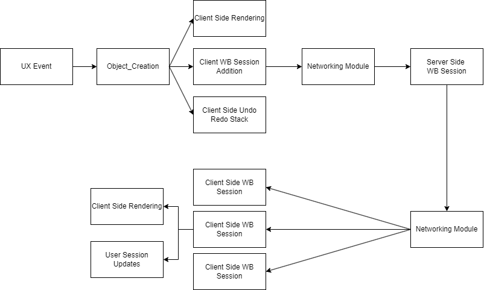
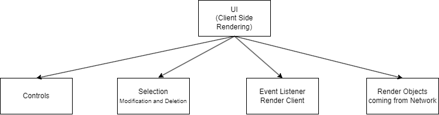

# Design Specification - White Board Module


## Objective and Background
We aim to make a whiteboard module for the Plexshare app.  A whiteboard is a shared visual workspace that allows teams or users to collaborate in real time from anywhere. Or in other words it’s really just a virtual whiteboard that team members can jot down observations, ideas etc.

## Requirements
We plan to make the whiteboard module with the following features.

1. Provide a WhiteBoard Interface to support the following draw features in real time.
    1. Draw shapes such as lines, rectangles, circles, curves (free hand drawn curves) and add Text
    2. Select shapes and do the following operations
        * Translation
        * Stroke Color Change
        * Shape fill
        * Stroke width
    3. Deletion of shapes
2. Provide Undo Redo capability for each client
3. Provide for saving of checkpoints and restore to previous checkpoints as well as to export whiteboard as png.
4. Provide an active mode (draw and see) and an inactive mode (see only) for each client
5. Provide a mode to see who drew the selected shape. 

## Design

### Module Diagram


The whiteboard module uses the Networking module to send messages across the network between server and clients. The whiteboard module uses the UX module to render the whiteboard on different clients.


### Main Workflow




When an user interacts (event trigger) with the whiteboard using mouse and keyboard events, the UI will capture the data of the events and use it to instantiate a new WhiteBoard Object on the Data Model. Now three important things occur client side rendering which renders the drawn object on that users screen, clients White Board State is updated and this object is added to the user undo_redo stack. 


Now all the Client Side WB State will send their new objects or modification to the server side White Board Session which sorts it and updates its state and sends all the aggregated objects (list of objects)  as a broadcast to all the clients.


Now each client on receiving the list of objects will update its client side White Board Session as well as update the active_mode (to draw and see or if off to only see).


We currently have only 1 whiteboard on a single server serving multiple clients. Multiple Whiteboards are currently in future scope.


### UI Client Side Rendering Components



The UI has four major components namely

Controls - This includes the brush type, eraser, select, font size, draw (rectangle, circle and free hand curves), undo, redo, select mode etc. This is the mode which decides what the user triggers will result in.

Selection - We have single and multi object selection. On selection we can translate it, change the color or delete multiple objects in one go.

Event Listener Render Client - When the User tries to draw an object on the whiteboard, after the client state white board management is updated this is rendered on the client’s screen. This is only called if the user tries to draw something new.

Render Objects coming from Network - When a client receives a set of objects from the network, it updates the client side WB state after that the objects are rendered on each client.

A design challenge we have here is  to try and reduce the number of renders without rendering everything at each time frame. Say for example draw is happening for the majority of the time we can overlay new graphics on the existing whiteboard context instead of rendering everything. This may not work for deletion or modification on which a totally new render might be required.


## Architecture


### User Session

We have user session management at the client side to have various features such as

Properties 
* user_id - user_id of the client
* active_mode - is in active_mode (if on can draw and see, if off can only see)
* i_am_admin - is admin 
* admin_only - to store if in admin_write_only_mode, if so only the admin(s) can write on the whiteboard and the user cannot toggle between the active_modes

Interface

```cpp
public interface IUserSession{
    // returns the user_id of the user session
    int get_userid();

    // returns if the current user is in active_mode
	bool is_active_mode();

    // returns if the user is part of the admin group
	bool is_admin();
    
    // returns if the whiteboard is in a state where only the admin can draw
	bool is_admin_only();

    // toggles on the user's active mode
	int on_active_mode();
    
    // toggles off the user's active mode
	int off_active_mode();
	
    // toggles on the admin_only mode and disables all the non-admin users to see only mode
    int on_admin_only();

    // toggles off the admin_only mode and enables all the non-admin users to toggle their active_mode
	int off_admin_only();
}
```


### White Board State Management

We have a white Board State Management. We will be having a single WB State on the Server Side, all the Client Side will sync to make their client side states same as the server side. The communication between them occurs through the Network Module


#### Client Side
Here we maintain a whiteboard state as well as the undo redo stacks for each client. Whenever the ClientSide WB is changed it is automatically  in the view.

* State_wb
    * Maintain a state
    * Update_state
    * Request for a synced whiteboard state from server
* User undo_redo_stack

### Server Side
* State_whiteBoard
    * new White Board State
    * Pass the board state to a new_client or lost connection
    * Update the state by aggregating new objects and broadcast to all the changes


### Shape Object

This defines the shape object which forms the core of the whiteboard. A whiteBoard consists of many shape objects which are rendered. We have a Shape Object from which all other shapes inherit and build upon. Standard Shapes extend the Shape class and consist of rectangles and circles. TextBox is also provided

Interface

```cpp
abstract class Shape 
{}

abstract class StandardShape : Shape
{}

class RandomCurve : Shape
{}

class Circle : StandardShape
{
	public Circle(Coordinates centre,
				double radius,
				Intensity fillColor,
				Intensity lineColor, 
				double thicknessVal) 
	{}
}

class Rectangle : StandardShape
{
	public Rectangle(List<Coordinate> points,
					Intensity fillColor
					Intensity lineColor,
					double thicknessVal) 
	{}
}

class Line : StandardShape
{
	public Line(List<Coordinate> points,
				Intensity lineColor
				double thicknessVal) 
	{}
}
```


### Controls
This controls how everything is rendered on each whiteboard. The controls include the tools and the options that enables the user to have finer control over what the user wants to draw on the canvas. The main features are (same will be visible on the UI)

* Select 
    * Single Select
    * Multi Select
* Brush
    * Thickness
    * Color
* Line
    * Thickness
    * Color
* Rectangle
    * Thickness
    * Color
    * Fill
* Circle
    * Thickness
    * Color
    * Fill
* Text
    Font * Type
    Font * Size
* Undo
* Redo
* Eraser
* Clean the  whiteboard
* Mode


#### Select
* There are two modes to select objects
* Single select mode - In this mode we can click on any point in the canvas and the top most object at that point will be selected
* Multi select mode - In this mode we can draw a rectangle selection and all the objects that lie completely within this selection are selected
* On selection we can do a translation, deletion, color, thickness change

#### Brush	
* We can change the brush parameters of thickness and color of the stroke
* We could each parameter individually or we could use pre baked combinations under different brush names
* Using this brush parameters the shapes are drawn 

#### Line, Rectangle, Text
* In this mode we can draw lines, rectangles and text of different thickness, stroke color and fill color.


#### Undo Redo
* On clicking undo the last operation done by that user is undoed
* On clicking redo the undone operation can be brought back.

#### Eraser
* An entire Object can be deleted by clicking on any part of the object.
* If multiple objects are overlapping in a pixel, the object lying at the top of that pixel is erased


### Clean the whiteboard
* The entire whiteboard is reseted like new

### Mode
* In which mode the user is currently in 
* The admin can toggle this button and make it admin_only mode


### Canvas UI 

The main UI of the whiteboard is split into 4 tasks in the UI Client Side Rendering Components of which this consists of 2 of them. 

1. To listen for user events to draw on which an object is created and the client side white board state is updated and the corresponding object is rendered at the same time.
1. To receive changes from the Client Side White Board Session Management and render it on the UI.

It listens on mouse events (released, clicked, dragged etc). The interfaces to draw Multiple shapes are provided. Objects can also be modified and deleted. Any updates made on the client side WB session (model) is subsequently reflected on the view i.e. the canvas.

### Networking and Persistence

Networking on the WhiteBoard module use the Networking Module and does 2 main things
1. Serialize - To serialse any object that needs to be sent across the network
1. Deserialize - To deserialse any object that is received from the network


Here we have Persistence which has two features. These are saved and loaded from the server side. 
1. Store Board State  - This is used to store the current state of the WB on the server side.
1. Load Board State - This is used to load a saved state of the WB from the server side as the current state.


## Team Members and Work Division

* Jerry John Thomas - User Session Management
* Aiswarya H - White Board Session Management - Server and Client Side  
* Asha Jose - Shape Object and operations, selection and modification (UI)  
* Parvathy S Kumar - Controller (UI included)
* Deon Saji - UI of canvas
* Joel Sam Mathew - Networking and Persistence


